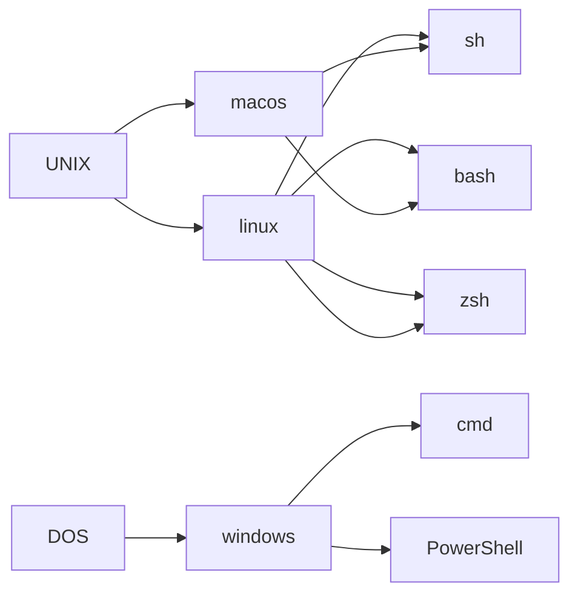

Links: [[INDEX]]
Rel: 
Tags: #private 
Ref: [github](https://github.com/); [stackoverflow](https://stackoverflow.com/); [stackexchange](https://stackexchange.com/)

--- 
**OOP** : 
- [[PYTHON]]
- [[PowerShell]]
- [[Java]]
- [[Swift]]

**markup languages** :
- [[markdown]]
- [[html]]
- [[css]]

**tools** :
- [[git]]
- [[uml]]
- [[regular_expressions]]
- [[database rules]]
- [[webhook requests]]
- [[APIs]]
- [[NLTK]]
- [[machine learning]]


--- 


hello.sh

```sh
echo "Hello World"
```
```sh
% chmod 777 hello.sh
% ./hello.sh
Hello World
% 
```
--- 

OSes (operating systems):
-> [[macos]]
-> [[linux]]
-> [[windows]]



--- 
[[security]]
[[networking]]
[[database rules]]
[[pi hole]]
[[gitea]]


--- 
tools:
[[crontab]] | [[Task Scheduler]] (programmatic scheduling)
[[tmux]] | [[emacs]] (terminal multiplier)
[[nano]] | [[vi]] | [[subl]] (text editors)
[[sh profile]] (macos/linux)

vmware virtual machines 

TCPView - a graphical netstat tool (by Mark Russinovich @sysinternals); highlights: green=new connection establishing (e.g. open browser), red=CLOSE_WAIT; (right-click-> "End Process")

--- 
IT:
[[Jamf 100 Cert]] (iBeacons)
[[CompTIA Network+ Cert (N10-007)]]
[[CompTIA A+ Cert (220-1001)]]
[[CompTIA A+ Cert (220-1002)]]

[[aplus_acronyms]]
[[aplus_minified]]
[[cli_interfaces]]


--- 
#### terms

kiss dry because worse is better

"**Rule of 3**" : When you get to 3 go back to 1/2"

"**script**" : an ordered series of instruction

