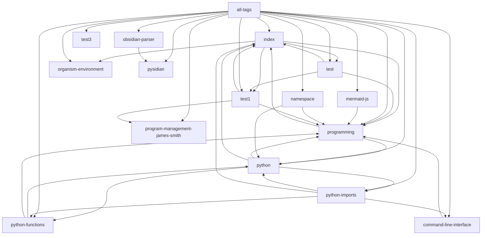

#private 

```mermaid
	graph TD;
	A[index]
	B[programming]
	C[python]
	D[program-management-james-smith]
	E[test]
	F[all-tags]
	G[command-line-interface]
	H[mermaid-js]
	I[namespace]
	J[obsidian-parser]
	K[organism-environment]
	L[pysidian]
	M[python-functions]
	N[python-imports]
	O[test1]
	P[test3]
	A --> O
	A --> B
	A --> K
	A --> E
	B --> A
	B --> C
	C --> B
	C --> A
	C --> M
	C --> N
	E --> A
	E --> B
	E --> O
	F --> C
	F --> H
	F --> N
	F --> A
	F --> I
	F --> M
	F --> D
	F --> O
	F --> B
	F --> K
	F --> L
	F --> E
	F --> G
	F --> P
	F --> J
	G --> B
	H --> B
	I --> C
	I --> B
	J --> L
	M --> C
	M --> B
	N --> C
	N --> G
	N --> A
	N --> M
	O --> D
	O --> B
	O --> A
```