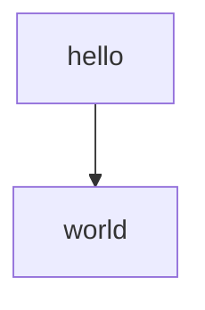
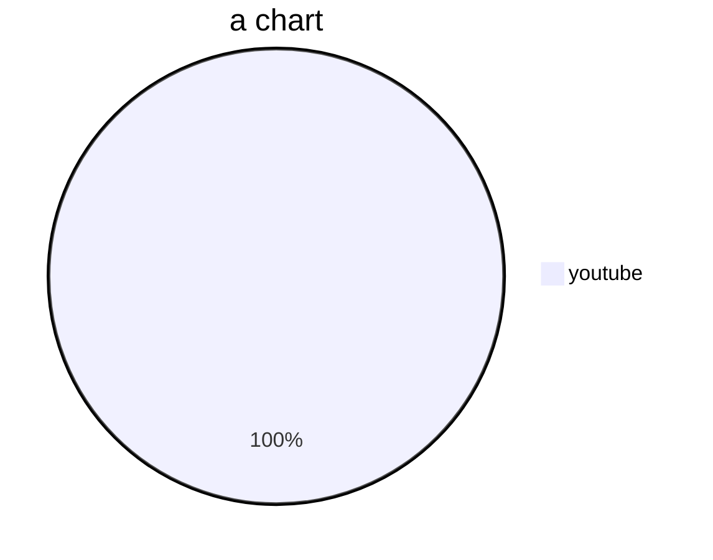
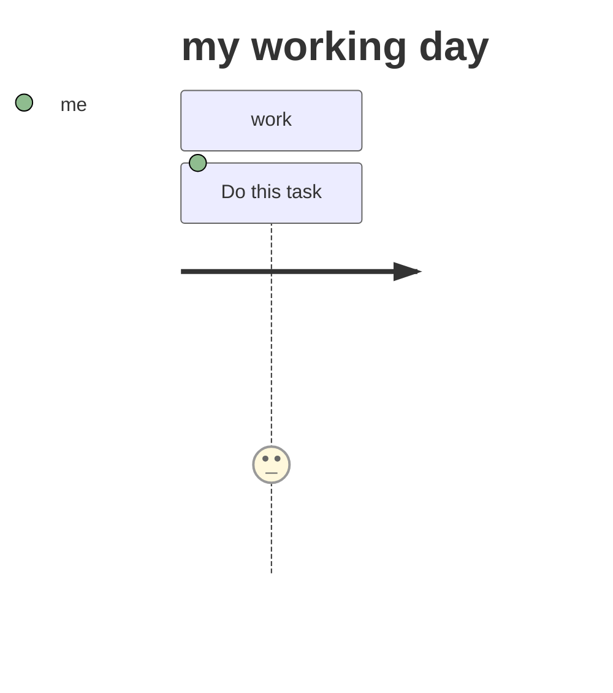
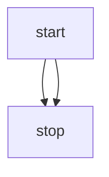

Links: [[PROGRAMMING]]
Ref: https://mermaid-js.github.io/mermaid/#/; https://github.com/mermaid-js/mermaid/blob/develop/docs/usage.md 
- https://github.com/mermaid-js/mermaid/blob/develop/docs/Setup.md#mermaidapi-configuration-defaults
- https://mermaid-js.github.io/mermaid-live-editor/
- https://github.com/mermaid-js/mermaid/tree/master/src/themes
Tags: #private #prog 

--- 
Mermaid js chart generation

https://mermaid-js.github.io/mermaid/#/flowchart
-   TB - top to bottom
-   TD - top-down/ same as top to bottom
-   BT - bottom to top
-   RL - right to left
-   LR - left to right

```
graph TD;
	a[hello] --> b[world]
```





user journey diagram


flowcharts


```html
<!DOCTYPE html>
<html lang="en">
<head>
  <meta charset="utf-8">
</head>
<body>
  <div class="mermaid">
  graph LR
      A --- B
      B-->C[fa:fa-ban forbidden]
      B-->D(fa:fa-spinner);
  </div>
 <script src="https://cdn.jsdelivr.net/npm/mermaid/dist/mermaid.min.js"></script>
 <script>mermaid.initialize({startOnLoad:true});</script>
</body>
</html>
```