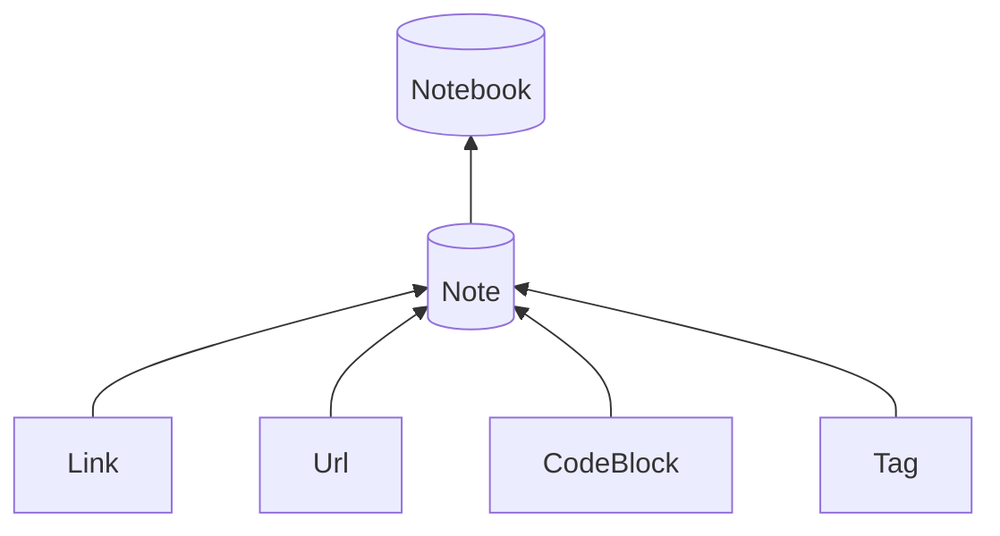

Links: [[PROJECTS]]
Rel: [[fastapi]]; [[highlight js]]; [[mermaid js]]; [[all public]]
Tags: #proj 
Ref: [github](https://github.com/prettynb)
... : -> [[pretty notebook primer]] <- 
- [[README-pnbp]]
- [[README-pnbp-pnbp]]
- [[README-pnbp-commands]]
- [[README-pnbp-blog]]
- [[README-pnano]]
- ... 
- https://stackoverflow.com/questions/49787860/not-able-to-upload-package-in-https-upload-pypi-org-legacy
- https://pypi.org/project/pnbp/

--- 



--- 
#todos

pnbp
- -> init **tests/**
- ensure renamed Note -> adjust name in backlink mentions
- todo : add back button
- todo : section specific tagging 
- todo : search method (local & blog)
- todo : -> [textual](https://github.com/Textualize/textual) app
- todo : issue! (pnano) fix multiple process spawn of nano on “exit”
- todo : complete \[x\] by section / by day
- todo : issue! (pnbp) header “—-“ -> “—- “
- todo : pnbp/commands/training -> datatables ([1](https://datatables.net/extensions/buttons/examples/styling/bootstrap5) ,[2](https://datatables.net/examples/api/multi_filter_select.html))

pnbp-blog
- -> (blog) bug: fix favicon route && document how to POST it
- -> (...) handle: Link to other / \<iframe embedded (e.g. Juypytr notebook (e.g. nutrition based via have + extract fxns from google sheet -> dataframe)
- -> (...) handle: latex https://www.latex-project.org/get/
- -> (...) (...) better auth system -> selectively #public per/via user/group tag? (e.g. #alice -> specific user privileges // [[PEEPS]]; Shared note through priv git (gitea on server))
- -> (docs) (blog) bug: commit -> /blog removes default .gitignore file (-> would commit if) 

pnano
- ? [INDEX](nano:///Users/curtis/Library/Mobile%20Documents/com~apple~CloudDocs/Stuff/onotes/INDEX.md)

future
- "all diff" -> respond to deleted note
- -> def _nb-get_notebook_init 
- -> Remove / replace specific link mentions 
- -> handle emoji tags
- (docs) (local) qol: improve console print statements; add to the comment string for all commands --help expansion view
- (docs) document cron command use (#todo: test Task Scheduler w/ chocolatey git https://community.chocolatey.org/packages/git); symlinks aren't native supported windows ... https://github.com/chrisdmacrae/symlinks-obsidian/tree/main ... handle anyways.)
- (docs) (pnbp) add rich to requirements.txt and setup.py
- automatic pretty MOC(s) via reverse-link look-ups
- PEEPS <- alphabetical rolodex by section
- (collect.py) TERMS -> what kind???
- (collect.py) TERMS -> #jots section -> ? (e.g. scope, retroactive)
- (correct.py) qol: threadpool the O(n^2) command
- (code.py) ... replace >>> . % $ (prompts) or ignore these blocks or or
- (code.py) ... handle for json in **extract-all-codeblocks** (aka how to name outside of comment?)
- (subl) ... command to delete old/broken/all symlinks from NOTE_PATH
- (tasks.py) ... scheduled todo by timestamp -> show up in today
- (collect.py) parse n.header content
- -> (pnbp -> blog) courses, books, etc. #public links to exclude note content (but keep reference linked header) (?)
- -> (...) (...) (...) pnbp-dashboard - e.g. http://127.0.0.1:8080/api/open/?app=Sublime+Text and ```<iframe src="http://127.0.0.1:8000/"></iframe>```

\[\[TERMS\]\] -> 
\[\[X\]\], \[\[Y\]\], \[\[Z\]\] (inclusive)
\[\[X\]\], \[\[Y\]\], 
\[\[X\]\], 

```py
from collections import defaultdict
import pnbp
nb = pnbp.Notebook()

terms = [n for n in nb.notes.values() if n.is_linked('TERMS')]

td = defaultdict(list)
for n in terms:
	td[n.name] = []
	for l in n.links:
		if not l.link == 'TERMS':
			print(l.link)
			if l.link in nb.links:
				# it's a real link
				if l.resolve(nb).is_tagged('#moc'):
					# -> TypeError when [[fake link]] ...
					td[n.name].append(n)

print(td)
```

... 
```json
{
	"_fname": "something.json",
	...
}
```
```
try:
	x = json.loads()
except:
	...
	
if isinstance(x, list):
	pass
elif isinstance(x, dict):
else:
	...

```
... 
```py
from commands import training as train
	...
	create_command(train._create_trainee)
	create_command(train._loads_trainee)
	create_command(train._collect_all_training)
```

--- 

--- 
#complete
- a parsing function to turn internal \[\[\]\] wiki links into relative domain/slug links, tagging FOR specific files to .md -> .html & commit
- a \#tag system to denote "this file belongs to public branch" aka partially commit to #git to denote commited file
- stipulation of #tags and # header via \s and -> \#
- endpoints to check against re-PUT for images 
- class capture of internal links, tags, external links, etc. 
- names need to be converted and handled like-this-dashed
- managing mermaid js ->  (handled in layout template...)
- if a note has no links -> all unlinked
- if a note has no content -> trash
- [[TERMS]] -> an MOC 
- MOCs == ALL CAPS; #moc 
- chore list -> if checked... go back to unchecked -> record! + (last done)
- singular place to clean_ name...
- (local) link / backlink graph -> mermaid js (graph.py)
- (local) can you metaprogram -> setup.py \[ console scripts \] ? yes.
- (local) nb.get_tagged("#public")
- (local) remove [[ TODAY ]] ( spacing )
- (local) add \\n per note (for 1writer)
- (local) git scripts & cron job
- (local) command to get full cli.py --help message 
- separate out # tags and and comments within ```code blocks``` && urls 
- (local) fix escaping of # within comments of code blocks
- -> models, note.cblocks
- (local) commands/
	- collect.py
	- tasks.py
	- blog.py
	- ... (aka modularize)
- (local) \#tasks & ensure tasks logic (populate aliases to a single todo note (tasks) -> \_complete -> uncheck/remove from both)
- Modernize collect.py with method access
- notebook stats (e.g. how many notes?) ?
- built _link_unlinked_mentions 
- (local) remove \[\[  \]\] -> html on non-public note links?
- add tag functionality to graph._create_link_graph
- (blog) fixed create_user partial dependency, password reset endpoint
- (local) appended user gen + etc user api methods to nb model 
- (blog) ~~full navbar via json -> file (versus template variables)~~-> updated settings and dark mode concept 
- ~~(local) subl?? better to pull out non- notebook commands ?~~ -> included at commands/subl.py
- (local) fixed/->added fxnality for scroll to section links (aka footnotes, intra/inter sub-header-ed )
- (local) handle for ~~strikethrough~~ ->html
- (local) handle flinks,
- handle for non-tag sub-internal-links 
- refactor commands -> note model 
- (local) code.py codeblock to file and run
- pretty print w/ row across to open note called in each text editor situation, —editor curr setting for embedded print (req: [[pnano]], [[ppnbp]] )
- Order all notes -edit time
- fix cleanup.py \_fix\_link\_spacing
- handle for json in code.py
- ignore able MOC's with #cont, explicit "moc's" with #moc (if both, #cont is respected as non-MOC)
- is\_tagged & is\_linked -> accept iterable and better handling
- #public staging, and explicit elim with #private
- -> all commands to prepended w/ nb- if not
- sig improvement to settings handling -> envvar NOTE_PATH -> nb/'pnbp-config.json'
- git diff ( -> "all diff" at tiny intervals and have a page update with you live as you generate content to it)
- handle same boilerplate if not md_out -> ...
- CodeBlock -> Note && debug 
- update blog README from blog-settings -> pnbp_conf; update pnbp README same + 
- [ ] todo (not forget that maybe this thinks a param in place) haha, broke it
- #tags handle for not in n.tags if it's the very very first thing in the note (\\n fixes...)
- track pnbp generated .md files -> provide method to delete all
- same slugname property on Note and Link ... (handled)
- clear debugging print statements
- update nb default conf dict (and README s)
- **nb-git-clone-pnbp-blog** - command to clone to a new blog/ 
- (blog) add **TITLE** to blog settings
- \#moc to generic to docs 
- (collect) Generic TERMS in conf (-> TERMS_NOTE)
- (code) File names -> code block to sep (&& etc. mod + CodeBlock improvements)
- Notebook. find and replace -> require notes=\[\] to be passed in 
- \_note\_ ... pattern on -n accepting **commands** (-> nbn_ )
- (local) handle for nested directory structure!
- (notebook.py) get random note!
- -> (pnano) bug: ... [[It's called The Internet]] breaks w/ " ' '"
- -> PyPi (-> 0.8.0 beta)
- (pnano) nb- -> nbn- (bug fix)

--- 

requirements:

pnbp
```
requests
click
markdown
rich
```

pnbp-blog
```
fastapi
uvicorn
jinja2
aiofiles
bcrypt
jwt
tortoise-orm
python-decouple
```

--- 

\<p\>nb\</p\>